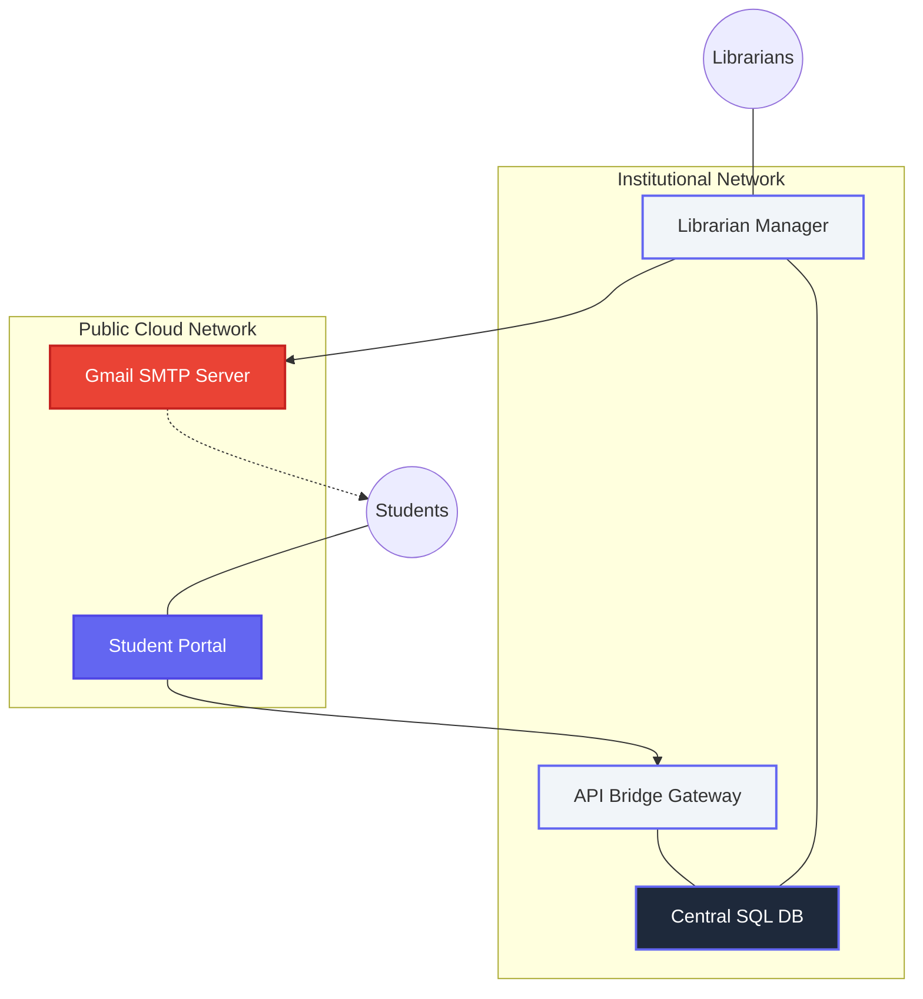

# 📚 HITECH Library Digital Ecosystem — Project Overview

The **HITECH Library Digital Ecosystem** is a modern, full-stack solution designed to transition the HITECH Library's traditional LIPS5 database into a highly accessible and automated digital platform. It serves as a comprehensive bridge between the library's internal records and the students/staff of the Hindustan Institute of Technology.

---

## 🌟 Key Functional Modules

### 1. Student Web Portal (Online OPAC)
The frontend interface allows students to access library services remotely from any device.
*   **Global Search Engine:** Advanced search capabilities across the entire library catalog by Title, Author, Accession Number, or ISBN.
*   **Real-time Availability Status:** Instant visibility into book availability, showing whether a title is currently on the shelf or borrowed by another student.
*   **Intelligent Filters:** Department-specific filtering (CSE, IT, MECH, etc.) to help students find relevant textbooks instantly.
*   **Personal Student Dashboard:** Secure login for students to track their current borrowings, due dates, and history.
*   **Fine & Overdue Tracking:** Real-time visibility into unpaid fines and overdue status with clear, color-coded indicators (e.g., Red for overdue).

### 2. Librarian Email Manager
A dedicated desktop application for library administrators to manage communication and ensure timely book returns.
*   **Proactive Reminders:** Automated identification and notification of students whose books are due in the next 24 hours to prevent fines before they happen.
*   **Dynamic Fine Calculation:** Intelligent overdue tracking that automatically excludes public holidays and Sundays from fine totals, ensuring accuracy and fairness.
*   **Smart Segregation:** Targeted communication for different member categories:
    *   **Active Students:** Grouped by batch/prefix for streamlined bulk messaging.
    *   **Passout & Inactive Members:** Specialized management of alumni accounts with pending library clearances.
    *   **Teachers & Staff:** Professional workflows for faculty members and departmental staff.
*   **Batch Communication:** Capability to send hundreds of personalized reminders in a single click, saving hours of manual labor.
*   **Communication Auditing:** A robust local history system that logs every email sent, providing a transparent record for institutional audits.

---

## 🏗️ System Architecture Overview

The ecosystem operates across a secure, multi-tier environment to balance global accessibility with institutional data security:

---

## 🛠️ High-Level Design Principles
The system is built on a robust, multi-tier architecture designed for security, performance, and reliability:

*   **Secure Data Bridge:** The application acts as a secure "read-only" gateway to the central SQL database. This ensures that the primary library records are never directly exposed to the internet and remain protected from unauthorized modifications.
*   **Hybrid Cloud Deployment:** High-performance cloud hosting for the frontend paired with a secure local bridge for the backend maintains data sovereignty while achieving global accessibility.
*   **Zero-Exposure Proxy:** Internal data is fetched through a secure middle-layer, preventing direct external access to the institution's core network.
*   **Optimized Performance:** Multi-threaded processing and intelligent caching ensure that searches are fast and emails are sent without system lag.

---

## 🚀 Strategic Impact & Value

The implementation of the Digital Ecosystem has transformed library operations:

1.  **Increased Book Circulation:** Clear visibility of titles and availability has encouraged more frequent borrowing and resource utilization among students.
2.  **Improved Return Rates:** Automated reminders have significantly reduced overdue instances, ensuring that popular books are returned on time for others to use.
3.  **Significant Labor Savings:** What used to take days of manual tracking and calling is now accomplished in minutes through automated data fetching and bulk emailing.
4.  **Enhanced Student Experience:** Students now enjoy a "self-service" model where they can check their status anytime, anywhere, without visiting the library physically.
5.  **Institutional Professionalism:** Modern, personalized email notifications and a sleek mobile-friendly portal elevate the library's image as a digitally-forward institution.

---

## 👥 User Roles

| Role | Core Capabilities |
| :--- | :--- |
| **Students** | Search books, check real-time availability, view personal history, and track fines. |
| **Librarians** | Monitor library usage, automate reminders, and manage large-scale returns. |
| **Teachers** | Track faculty resources and department-specific borrowing trends. |

---

*HITECH Library Project — Innovation in Digital Resource Management*

---

*Developed by the HITECH Library Project Team*
