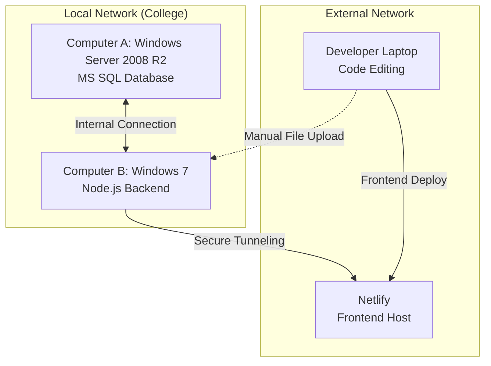

# 📚 Library Application Architecture & Deployment Workflow

This document outlines the architecture, file structure, and deployment workflow for the Library Application.

## 🏗️ System Architecture

The ecosystem consists of three distinct machines operating to serve the application:

1. **Computer A (Windows Server 2008 R2)**
   - **Role:** Database Server.
   - **Details:** Hosts the internal MS SQL Server database. It holds all library records, student data, and book availability. This machine is kept strictly internal for security purposes.

2. **Computer B (Windows 7)**
   - **Role:** Backend Node.js Server & Tunneling.
   - **Details:** Runs the Node.js backend API (`api_bridge/server.js`). It connects internally to the MS SQL Server on *Computer A* to fetch data safely. It then uses a secure tunneling service (e.g., localtunnel) to expose the backend API to the public internet without needing to change firewall settings or expose the local network.

3. **Developer Laptop (Windows)**
   - **Role:** Code Editing & Deployment Hub.
   - **Details:** Connected to a separate WiFi network (different IP from Computer A & B). Used for writing code, testing locally, and managing deployments.

4. **Netlify (Cloud Hosting)**
   - **Role:** Frontend Hosting.
   - **Details:** Hosts the public-facing frontend website (HTML/CSS/JS) so students can access the library system globally.

---

## 🚀 Deployment Workflow

Because the development environment (Laptop) is completely separated from the production environment (Local College Network), the deployment process is split into two phases:

### 1. Frontend Updates (Automated)
All frontend code is located in the `/public/` directory.
- When design or frontend logic is modified on the **Laptop**, the changes are deployed directly to **Netlify** using the Netlify CLI or Git integration.
- The Netlify-hosted frontend communicates with the backend via the tunneled public URL provided by Computer B.

### 2. Backend Updates (Manual Upload)
All backend API code is located in the `/api_bridge/` directory.
- When backend logic (e.g., `server.js` or database queries) is modified on the **Laptop**, the updated `.js` files must be **manually uploaded/transferred** to **Computer B**.
- Once transferred, the Node.js server on Computer B must be restarted to apply the changes.

---

## 📂 Project File Structure

- `/public/` : Contains the frontend website design (HTML, CSS, JS frontend logic). These files are deployed to Netlify.
- `/api_bridge/` : Contains the backend Node.js code (e.g., `server.js`). This acts as the "Middleman" proxy API that safely queries the database. These files are moved to Computer B.
- `netlify.toml` : Configuration file for Netlify frontend deployments.
- `package.json` : Project dependencies. (Needs to be installed on Computer B using `npm install` for the backend to run).
- `setup_mssql.sql` : SQL scripts and database setup instructions meant to be run on Computer A.
